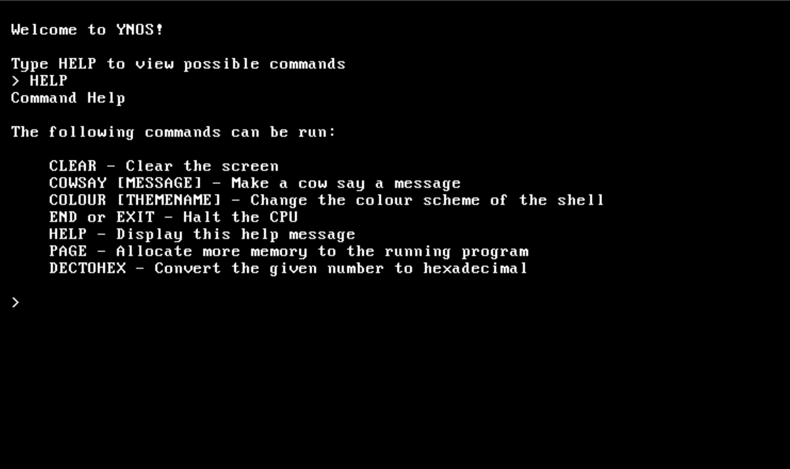

# YNOS

This is a 32-bit custom OS project built from scratch using C and assembly language.

# Dependencies
Running this code requires the following:

* GCC Cross Compiler - Instructions for this can be found on the [OS Dev Wiki](https://wiki.osdev.org/GCC_Cross-Compiler). The target platform is i686-elf.
* NASM - Assembly language used for the bootloader.
* QEMU - Virtual machine software used to boot the OS.
* GNU Make

# Build Instructions
Clone the repository:

```
git clone https://github.com/CianOSullivan/YNOS
```

To run the OS:

```
cd YNOS
make
./ynos
```

And the OS should be running in a QEMU window!

# Screenshots


